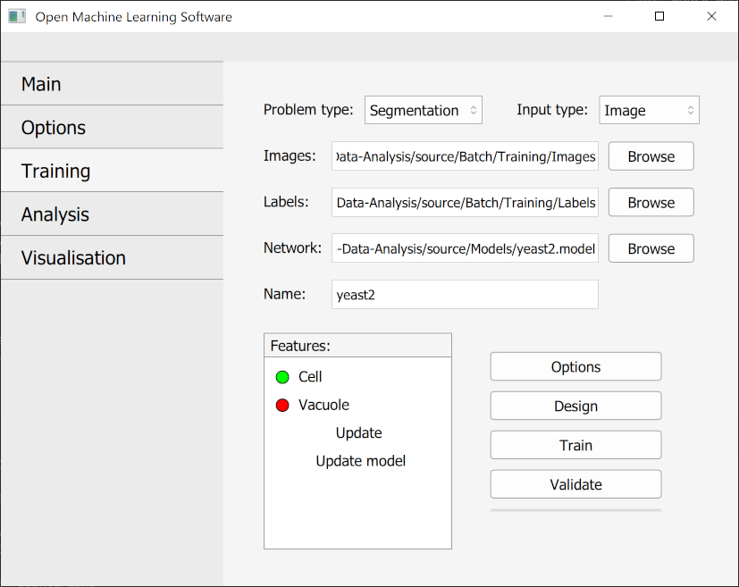
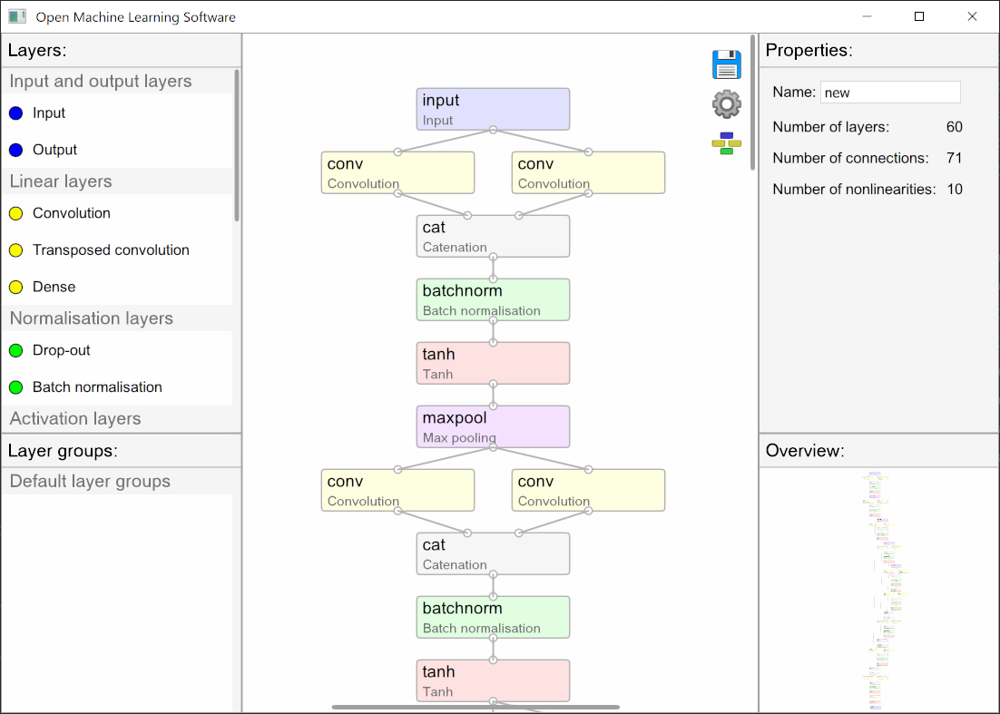
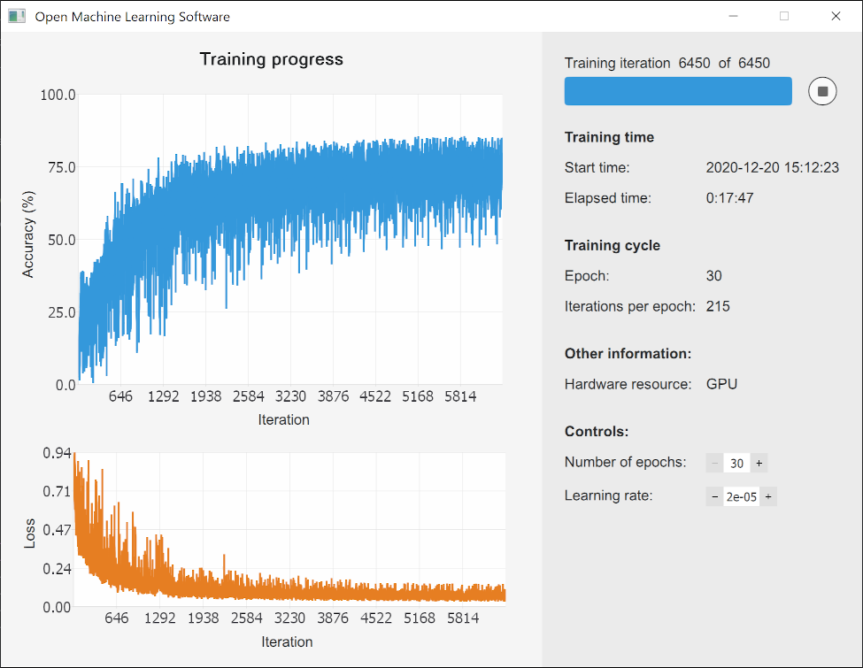
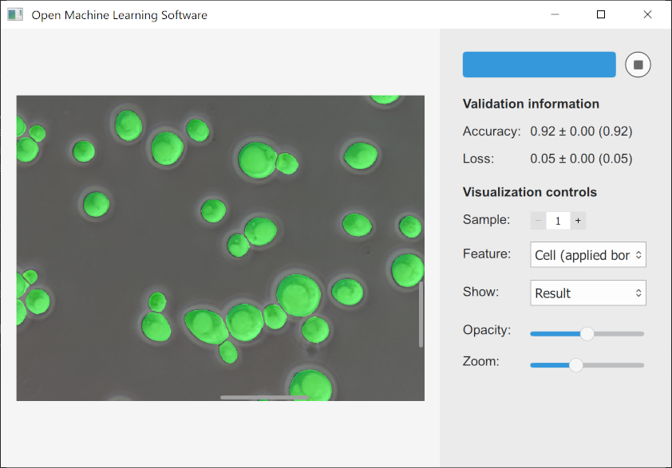
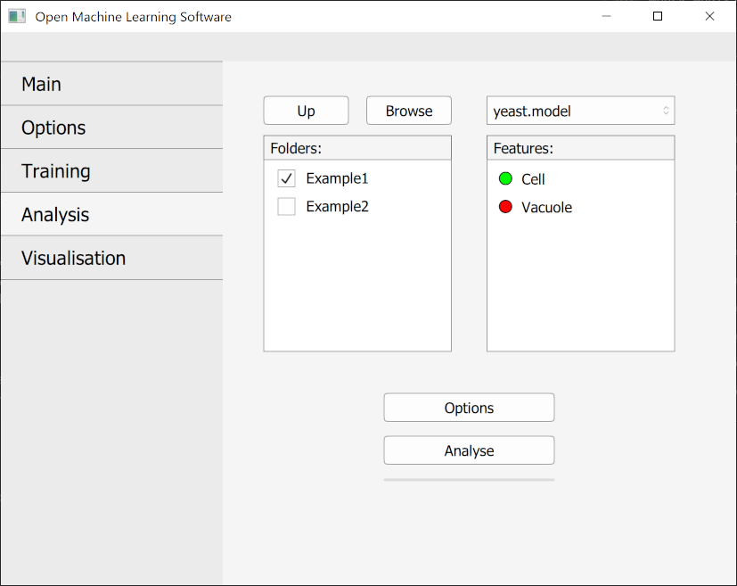

# Open Machine Learning Software

This software is designed to both allow people not familiar with coding or machine learning as well as professionals in these fields to easily design and apply machine learning methods and data processing functions to images or data sequences.

NB! This is a pre-alpha version. Bugs and rapid changes should be expected! Release is currently scheduled for May 2021.

### Preview

    

### Setting up
Download binaries: Windows (not implemented), Mac (not implemented), Linux (not implemented)

Software can also be run in Julia environment by cloning the repository, installing packages mentioned in packages.jl and then executing main.jl.

### Features
We use Flux.jl neural network library. Currently it is possible to:
  - Design a neural network
  - Train a neural network
  - Validate a neural network
  - Analyse data with a neural network
  
Only image data and image segmentation is currently supported.

### Goals
1. Ease of set-up and use
      - Simple installation
      - Intuitive interface
2. Ease of contribution
      - Extensive documentation
      - Modular design
3. Democratic development process
      - Built-in voting feature
4. High processing speed
      - Intrinsic advantage of the Julia programming language

### Project support
We use a voluntary support scheme in order to finance the development. 

Software can be supported by donations.

Financial reports detailing incomes and expenses are published monthly.
